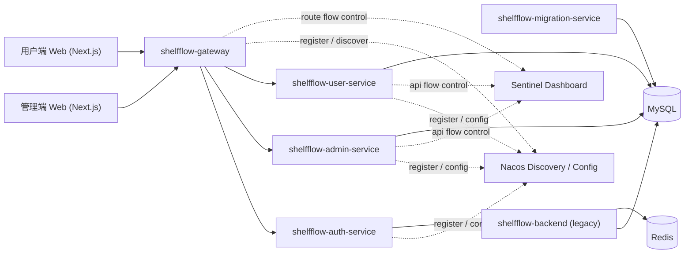
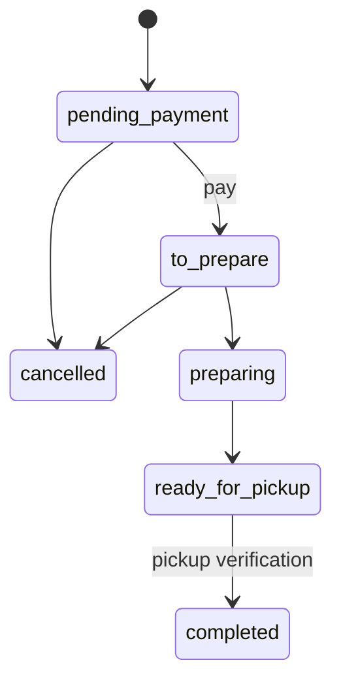

# ShelfFlow 架构说明

## 1. 项目目标

ShelfFlow 是一个围绕临期库存流转构建的双端业务系统，目标不是 demo，而是具备真实业务闭环、可维护性和可扩展性的 production-ready Java 后端项目。

当前第一阶段已落地两条主线：

- 管理端：商品管理、批次管理、动态定价、订单履约
- 用户端：商品目录、购物车、订单提交、支付、取消、订单详情

## 2. 总体架构



## 3. 仓库结构

```text
ShelfFlow
├── apps
│   ├── shelfflow-admin-web
│   └── shelfflow-user-web
├── services
│   ├── shelfflow-gateway
│   ├── shelfflow-auth-service
│   ├── shelfflow-admin-service
│   ├── shelfflow-user-service
│   └── shelfflow-service-common
├── packages
│   ├── shelfflow-config
│   ├── shelfflow-contracts
│   └── shelfflow-shared
├── docs
├── scripts
└── shelfflow-backend
```

## 4. 服务职责

### 4.1 `shelfflow-gateway`

负责统一 API 入口：

- 暴露 `/api/**`
- 路由到 auth/admin/user 三个业务服务
- 统一跨域策略
- 统一请求入口
- 默认使用固定 URL 方便本地开发
- 开启 `nacos` profile 后使用 `lb://服务名` 基于 Nacos 注册发现路由
- 接入 Sentinel Gateway 规则，对用户端、认证和 AI 等高风险路由做入口保护

### 4.2 `shelfflow-auth-service`

负责管理员认证和会话语义：

- 管理员登录
- 当前管理员会话
- JWT 载荷输出
- 对 legacy 登录结果做统一错误映射

### 4.3 `shelfflow-admin-service`

负责管理端核心业务：

- 商品分页、创建、更新
- 批次分页、详情、创建、更新、状态流转
- 定价规则分页、创建、更新、启停
- 基于临期批次生成 AI 定价建议
- 损耗统计总览、分类聚合和处置建议
- AI 运营助手建议、知识库和本地规则问答
- 订单分页、详情、履约状态流转

当前服务层按以下分层组织：

```text
controller -> application service -> domain policy -> persistence mapper
```

### 4.4 `shelfflow-user-service`

负责用户端核心业务：

- 用户登录 / 会话
- 商品目录 / 商品详情
- 购物车
- 订单提交 / 支付 / 取消 / 详情 / 列表

同样采用：

```text
controller -> application service -> domain policy -> persistence mapper
```

### 4.5 `shelfflow-service-common`

负责沉淀横切能力：

- 统一响应结构
- 错误码
- 分页模型
- 状态枚举
- 管理员 / 用户鉴权上下文
- 全局异常处理
- MVC 拦截与参数转换
- Sentinel 通用接口限流规则装配

### 4.7 `shelfflow-migration-service`

负责数据库结构版本化：

- 独立运行，不常驻端口
- 使用 Flyway 管理 `db/migration` 下的版本脚本
- 新库先执行基础结构脚本，再执行增量迁移
- 旧库通过 `baseline-on-migrate` 建立基线，后续执行幂等迁移
- 业务服务不负责自动抢占式迁移，避免多个服务同时改表

### 4.8 Spring Cloud Alibaba 接入

Spring Cloud Alibaba 组件按“默认关闭、按需开启”的方式接入，避免本地开发必须依赖完整中间件：

- Nacos Discovery：四个 Java 服务均支持注册到 Nacos。
- Nacos Config：通过 `bootstrap.yml` 支持读取共享配置 `shelfflow-common.yaml` 和服务级配置。
- Spring Cloud Gateway LoadBalancer：网关在 `nacos` profile 下使用 `lb://shelfflow-auth-service`、`lb://shelfflow-admin-service`、`lb://shelfflow-user-service` 路由。
- Sentinel：服务侧维护接口级 QPS 规则，网关侧维护 routeId 级入口规则。

核心开关：

```text
SHELFFLOW_NACOS_ENABLED=true
SHELFFLOW_NACOS_CONFIG_ENABLED=true
SHELFFLOW_SENTINEL_ENABLED=true
SPRING_PROFILES_ACTIVE=nacos
```

限流规则不写死在业务代码中，统一通过 `shelfflow.sentinel.*` 和 `shelfflow.gateway.sentinel.*` 配置管理，后续可迁移到 Nacos 配置中心动态维护。

本地演示资源：

- `docker-compose.alibaba.yml`：启动 Nacos 和 Sentinel Dashboard。
- `docs/nacos/shelfflow-common.yaml`：公共配置样例。
- `docs/nacos/shelfflow-*.yaml`：服务级配置样例。

### 4.6 `shelfflow-backend`

当前仍保留为第一阶段运行依赖和迁移来源：

- 认证和部分历史数据结构来自 legacy
- 随着 admin/user 服务继续演进，legacy 依赖会逐步下降

## 5. 关键业务模型

### 5.1 商品

商品是目录与库存批次的上游实体，承担：

- 商品展示信息
- 分类归属
- 标价信息
- 商品可售状态

### 5.2 批次

批次是 ShelfFlow 的核心聚合，承担：

- 临期库存承载
- 到期时间
- 动态价格基础口径
- 可售库存、锁定库存、已售库存
- 批次状态流转

### 5.3 订单

订单连接用户端购买行为和管理端履约行为：

- 用户端提交订单时锁定库存
- 取消订单时释放锁定库存
- 管理端按备货、待自提、自提核销推进履约状态
- 自提核销通过自提码确认用户取货
- 履约完成时将锁定库存结转到已售库存
- 每次关键状态变化都会写入 `order_event_log` 审计轨迹

### 5.4 定价规则

定价规则负责把临期策略从页面操作沉淀为后端业务能力：

- 规则按剩余保质期区间命中批次
- `priority` 决定多条规则同时命中时的优先级
- `discountRate` 统一作为动态价计算口径
- 管理端支持规则启停，避免删除规则导致审计和复盘困难
- AI 定价建议从真实临期批次生成，采纳后写入同一套规则模型

### 5.5 损耗统计

损耗统计以批次为核心聚合：

- 总览统计总批次、临期批次、售罄批次、可售库存和预估损耗金额
- 分类统计按商品分类聚合临期、售罄、过期库存和损耗率
- 处置建议按剩余过期天数、可用库存和预估损耗金额排序
- 临期窗口和建议条数通过 `shelfflow.admin.loss-stats` 配置管理

### 5.6 AI 运营助手

AI 运营助手采用可配置 provider：

- `provider=local` 时基于运营知识库和实时批次建议生成回答
- `provider=dashscope` 时通过 OpenAI-compatible Chat Completions 协议接入阿里云百炼
- 知识库支持分页、搜索、新增、编辑和删除
- 实时建议复用批次库存、剩余效期、售罄和高库存规则
- 建议执行会写入执行记录，保留执行动作、目标对象、操作摘要和结构化参数
- `shelfflow.admin.ai-ops` 管理 provider、model、建议条数和检索条数
- 后续替换外部大模型时保持 `/api/admin/ai-ops/chat` 契约稳定

### 5.7 自提点

自提点是用户端下单和管理端履约之间的线下交付节点：

- 管理端维护自提点名称、地址、联系人、电话和服务时间
- 用户端只读取启用状态的自提点
- 用户下单时绑定自提联系人和自提点语义
- 后续可扩展到距离排序、容量限制和门店营业状态

### 5.8 用户账号

用户账号围绕真实消费流程设计：

- 支持手机号或邮箱注册
- 注册、找回密码、修改手机号和邮箱需要验证码
- 修改密码需要校验当前登录密码
- 用户未登录可以浏览商品，购物车、订单和个人信息需要登录
- 默认自提信息从用户账号资料派生，也允许用户自行维护

## 6. 关键状态流转

### 6.1 用户订单状态



### 6.2 批次状态

批次状态当前至少覆盖：

- `active`
- `paused`
- `expired`

批次分页查询会在读取链路中执行到期刷新，保证状态与时间窗口一致。

## 7. 库存一致性设计

第一阶段库存一致性重点落在订单提交、取消、完成三个动作：

1. 提交订单  
   - 校验购物车项可售性
   - 校验可用库存
   - 可选通过 Redis Lua 做批次库存原子预占
   - 将 `locked_quantity` 增加
   - 写入订单和订单明细

2. 取消订单  
   - 仅允许特定状态取消
   - 将 `locked_quantity` 减少

3. 完成订单  
   - 由管理端履约完成
   - 将 `locked_quantity` 结转到 `sold_quantity`

这套设计的重点是把状态变化和库存变化保持在同一业务语义下，而不是散落在多个脚本或页面逻辑里。

并发库存保护分为两层：

- Redis Lua 预占层：开启 `USER_ORDER_INVENTORY_RESERVATION_MODE=redis_lua` 后，按批次维护短 TTL 的 in-flight 预占计数，避免高并发请求在数据库事务提交前集中穿透。
- 数据库最终防线：`inventory_batch` 更新仍使用 `stock_quantity - locked_quantity - sold_quantity >= quantity` 条件，保证即使 Redis 不可用或未开启，也不会突破真实库存。

Redis 预占记录只覆盖“正在提交但事务尚未完成”的短窗口；事务完成后释放预占计数，由数据库中的 `locked_quantity` 承接后续状态。

## 8. 测试与验收

当前项目已具备两层基础验收：

### 8.1 Java 测试

- service unit test
- MVC integration test
- H2 数据库级 integration test

### 8.2 前端构建

- 管理端：`npm run build -w @shelfflow/admin-web`
- 用户端：`npm run build -w @shelfflow/user-web`

## 9. 审计与可追踪性

订单链路已经补齐结构化审计日志：

- 表：`order_event_log`
- 记录范围：
  - 用户提交订单
  - 用户支付
  - 用户取消
  - 管理端履约状态推进
  - 管理端自提核销

每条日志记录：

- `event_type`
- `actor_type`
- `actor_id`
- `from_status / to_status`
- `from_pay_status / to_pay_status`
- `note`
- `create_time`

这样做的价值不是“多一张表”，而是把订单生命周期从黑盒操作变成可回放的业务轨迹。  
在排查状态异常、库存争议和履约问题时，可以直接沿事件时间线回溯。

管理端关键写操作也会进入操作日志：

- 表：`admin_operation_log`
- 记录范围：
  - 商品、分类、批次、定价规则写操作
  - 自提点维护
  - 订单履约和自提核销
  - AI 建议执行
- 记录内容：
  - 模块、操作类型、HTTP 方法、路径、状态码、操作者、摘要、创建时间

这部分日志用于管理端审计和日常排查，和订单事件日志形成互补：订单事件关注业务状态，操作日志关注后台人员做了什么。

## 10. 当前架构取舍

### 已做出的取舍

- 前端统一 Next.js，而不是保留多个前端栈
- 后端固定 Java / Spring Boot / Spring Cloud Alibaba
- 不为了“看起来是微服务”而过早拆更多服务
- 用 `service-common` 承载共享能力，而不是在各服务复制实现

### 暂未继续拆分的模块

以下模块保留为后续阶段，而不是在第一阶段过度拆分：

- order 独立服务
- fulfillment 独立服务
- ai ops

这是有意为之：当前 pricing、loss stats、ai ops 已作为 admin-service 内的领域模块落地，order / fulfillment 会在主流程稳定后再评估是否独立服务化，避免为了“拆服务”牺牲一致性和交付质量。

## 11. 后续演进方向

建议的下一阶段方向：

1. 幂等保护
2. 并发库存保护加强
3. 缓存与降级策略
4. 更细粒度权限模型
5. 订单独立服务化评估
6. 自提点容量和地理位置能力
7. AI 建议执行从“辅助操作”升级为可审批工作流
